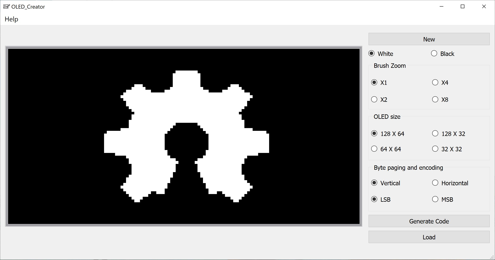

# OLED-Creator beta v2.0
OLED Creator is a software tool which helps to generate the pixel map in C code for SSD1306 driver

The OLED Creator is a simple tool that allows you to draw what you want and generate the code compatible to any monochrome oled display with a SSD1306 driver or similar.
It is also possible to import a monochrome .bmp Image, edit it and export the C code of it.

Note: the .bmp image to import must have a monochrome format and the size must be the one selected on the user interface otherwise you'll have an error.

The "Oled Creator beta.zip" file contains a folder with the software and libraries (you need to extract everything before execute the the .exe file) and a folder with some test files you can load into the software.

I developed the software with Qt Creator, so the executable "Oled_Creator.exe" needs all the Qt libraries included in the "resources_beta_v1.0" folder. 
